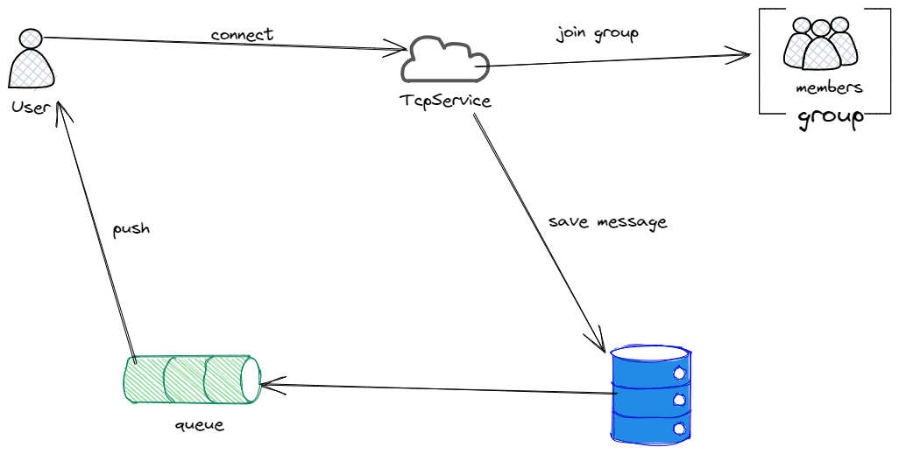

## GIM
golang实现的基于内存的聊天服务

## 架构


## 功能
- 支持私聊与群聊的消息发送
- 支持按会话查询历史消息
- 支持查询群成员

## 特性
- 推送策略：私聊全量推送，群聊按时间间隔推送最新n条数据
- 消息策略：通过SortedSet数据结构实现消息存储，按发送时间排序

## 启动
```
cd cmd
go build -o gim server.go
```

- 启动服务   
```
>gim --help
NAME:
   gim - simple and fast im service

USAGE:
   gim [global options] command [command options] [arguments...]

VERSION:
   1.0.0

COMMANDS:
   help, h  Shows a list of commands or help for one command

GLOBAL OPTIONS:
   --config FILE, -c FILE     Load configuration from FILE
   --debug                    Set debug mode (default: false)
   --help, -h                 show help (default: false)
   --limit value, -l value    Set max number of session history messages (default: 10000)
   --port value, -p value     Set tcp port (default: 8080)
   --push-count value         Set count of message push event (default: 5)
   --storage value, -s value  Set storage, like memory/redis (default: "memory")
   --version, -v              print the version (default: false)
```

## 选项设计
```
--message-protocol: 消息协议(json,proto)
--enable-message-sequence: 是否开启消息sequence
--message-push-count: 每次推送消息条数
--message-push-duration: 每次推送时间间隔
--message-push-concurrency-limit: 消息推送并发上限
```
## 模块设计
```

```

## 连接测试
```
wscat.cmd -c ws://127.0.0.1:8082
{"op":101,"body":"{\"id\":\"1001\"}"}
{"op":103}
{"op":201,"body":"{\"content\":\"test\",\"type\":\"private\",\"category\":\"text\",\"target_id\":\"1002\"}"}
```